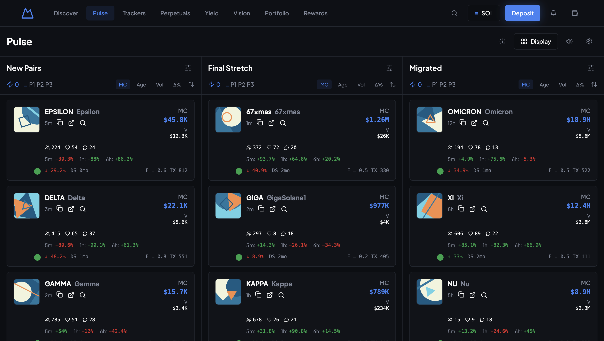
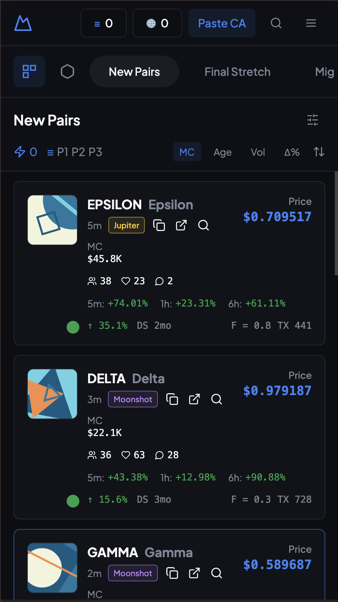
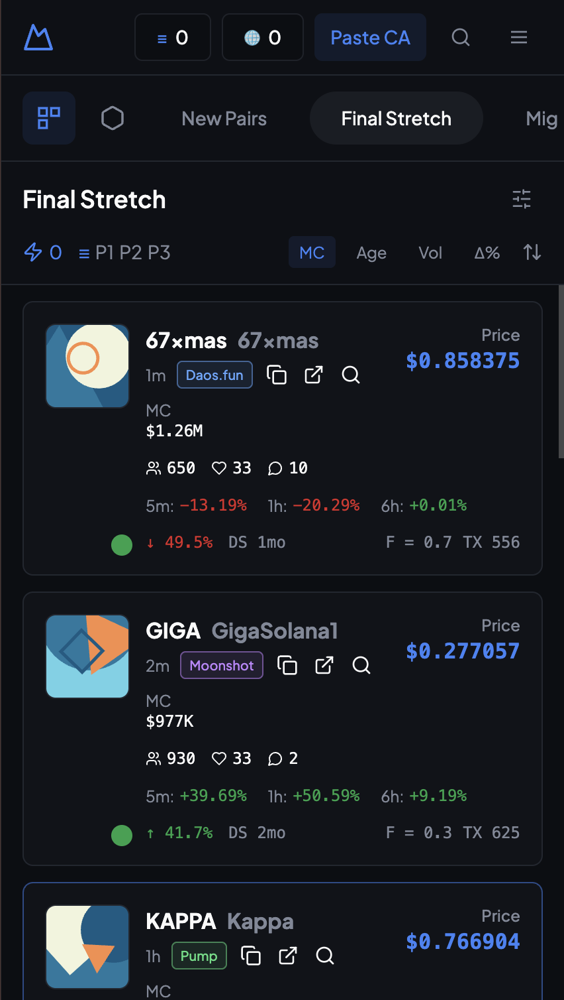

# Token Trading Dashboard

A high-performance, responsive cryptocurrency token tracking dashboard built with modern web technologies. This application provides real-time-like monitoring of token pairs across different lifecycle stages ("New Pairs", "Final Stretch", "Migrated").

## 🚀 Tech Stack

- **Framework:** [Vite](https://vitejs.dev/) + [React](https://react.dev/)
- **Language:** [TypeScript](https://www.typescriptlang.org/)
- **Styling:** [Tailwind CSS](https://tailwindcss.com/)
- **UI Components:** [shadcn/ui](https://ui.shadcn.com/) (based on Radix UI)
- **State Management & Data Fetching:** [TanStack Query](https://tanstack.com/query/latest)
- **Routing:** [React Router](https://reactrouter.com/)
- **Icons:** [Lucide React](https://lucide.dev/)
- **Charts:** [Recharts](https://recharts.org/)
- **Forms:** React Hook Form + Zod

## ✨ Features

- **Multi-Column Dashboard:**
  - **New Pairs:** Recently listed tokens.
  - **Final Stretch:** Tokens gaining momentum.
  - **Migrated:** Established tokens that have migrated.
- **Advanced Filtering & Sorting:**
  - Filter by search keywords, protocols, and Market Cap range.
  - Sort tokens by Market Cap, Age, Volume, and Price Change (1h).
- **Interactive UI:**
  - Hover effects on token cards revealing detailed metrics (Holders, Likes, Comments, Price Changes).
  - Smooth transitions and animations.
  - Responsive grid layout adapting to mobile and desktop screens.
- **Real-time Simulation:**
  - Mock data integration simulating live token updates.
  - Skeleton loading states for improved UX.

## 📸 Screenshots

### Desktop View

*Dashboard view showing all three token columns with filtering options.*

### Mobile View
<div style="display: flex; gap: 10px;">
  
  
</div>
*Responsive mobile layout optimized for smaller screens.*

## 🛠️ Getting Started

Follow these steps to run the project locally:

### Prerequisites
- Node.js (v18 or higher)
- npm or yarn

### Installation

1. **Clone the repository**
   ```bash
   git clone https://github.com/yourusername/token-trading-app.git
   cd token-trading-app
   ```

2. **Install dependencies**
   ```bash
   npm install
   # or
   yarn install
   ```

3. **Start the development server**
   ```bash
   npm run dev
   # or
   yarn dev
   ```

4. **Open your browser**
   Navigate to `http://localhost:8080` (or the port shown in your terminal).

## 📂 Project Structure

```
src/
├── components/         # Reusable UI components
│   ├── ui/            # shadcn/ui primitives (Button, Dialog, etc.)
│   ├── TokenColumn.tsx
│   ├── TokenCard.tsx
│   └── ...
├── hooks/             # Custom React hooks (use-toast, use-mobile)
├── lib/               # Utilities, types, and mock data
├── pages/             # Route components (Index, NotFound)
└── App.tsx            # Main application entry
```

## 🔄 Workflow

1. **Navigation:** Use the top bar to switch between different views (Pulse, Discover, etc.).
2. **Monitoring:** Watch the three main columns for token movements.
3. **Filtering:** Click the filter icon in any column header to narrow down tokens by specific criteria.
4. **Analysis:** Hover over any token card to see a quick snapshot of its performance metrics (5m, 1h, 6h changes).
